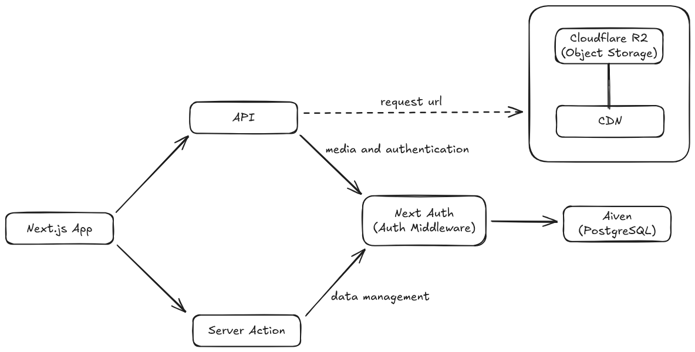
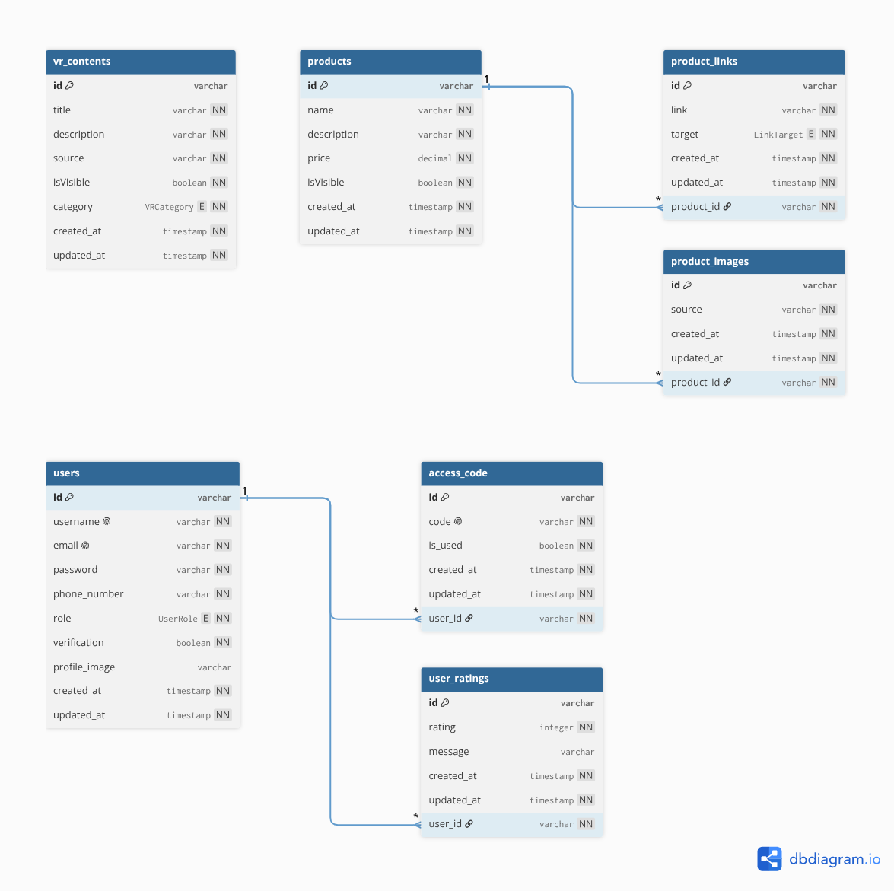
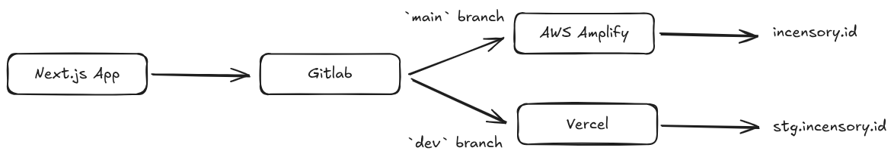
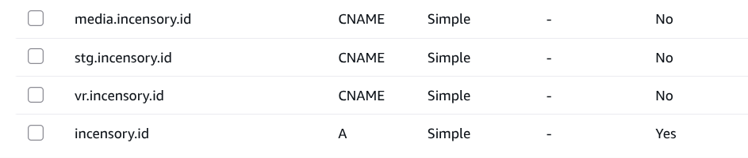

<p align="center">
  
</p>

<h3 align="center">Frankincense Perfume × Virtual Reality Therapy</h3>

<p align="center">
  Web application for information media & admin dashboard — PKMK Funding Event 2025
</p>

<p align="center">
  <a href="https://incensory.id">incensory.id</a> · <a href="https://stg.incensory.id">Staging</a> · <a href="https://vr.incensory.id">VR Content</a>
</p>

---

## Table of Contents

- [Overview](#overview)
- [Features](#features)
- [Architecture](#architecture)
- [Tech Stack](#tech-stack)
- [Project Structure](#project-structure)
- [Database Schema](#database-schema)
- [Deployment Workflow](#deployment-workflow)
- [Domain Management](#domain-management)
- [Getting Started](#getting-started)
- [Environment Variables](#environment-variables)
- [Scripts](#scripts)
- [Team](#team)
- [License](#license)

---

## Overview

**Incensory** is a product by the PKMK Team at Universitas Padjadjaran (2025) that combines frankincense-based perfume with virtual reality content for phobia therapy. The web application serves two purposes:

1. **Public & Customer Portal** — Product information landing page, user registration (gated by access code), product browsing with marketplace redirect, and exclusive VR content access.
2. **Admin CMS** — Content management system for managing products, VR content, access codes, and viewing user data.

### Access Code System

Each product purchase includes a unique **access code**. Customers must provide a valid, unused access code during registration. This mechanism preserves the exclusivity of VR therapy content — only verified buyers can access the virtual reality simulations.

---

## Features

### Customer

| Feature | Description |
|---|---|
| **Registration** | Sign up with credentials + unique product access code |
| **Email Verification** | Email-based account verification with JWT tokens |
| **Product Catalog** | Browse products with marketplace redirect (Shopee, Tokopedia, WhatsApp) |
| **VR Content Access** | Access phobia-specific VR simulations via authenticated token |
| **User Profile** | View and edit profile, including profile image upload |
| **Ratings & Reviews** | Submit product ratings and feedback |
| **Password Recovery** | Forgot password flow with email verification |

### Admin (CMS)

| Feature | Description |
|---|---|
| **Dashboard** | Overview of registered users and platform statistics |
| **Product Management** | Full CRUD for products, product images, and marketplace links |
| **VR Content Management** | Manage VR content entries (Acrophobia, Claustrophobia, Nyctophobia) |
| **Access Code Management** | Generate and manage batch access codes |

---

## Architecture

The application uses a hybrid communication pattern between the frontend and backend:

- **API Routes** — Used for external service integrations (Cloudflare R2 object storage, NextAuth authentication, VR token management)
- **Server Actions** — Used for direct data management operations (CRUD for products, users, access codes, etc.)

Media assets are served through **presigned URLs** — the frontend never requests object storage URLs directly. Instead, it requests a presigned URL from the API, which then returns the CDN-served media URL.

<p align="center">
  
</p>

---

## Tech Stack

### Core

| Technology | Version | Purpose |
|---|---|---|
| [Next.js](https://nextjs.org/) | 15.3.5 | React framework (App Router, Turbopack) |
| [React](https://react.dev/) | 19.x | UI library |
| [TypeScript](https://typescriptlang.org/) | 5.x | Type-safe JavaScript |
| [Tailwind CSS](https://tailwindcss.com/) | 4.x | Utility-first CSS framework |

### Backend & Data

| Technology | Purpose |
|---|---|
| [Prisma](https://prisma.io/) (v7.8) | ORM with PostgreSQL adapter |
| [NextAuth.js](https://next-auth.js.org/) (v4) | Authentication (Credentials provider, JWT strategy) |
| [bcrypt](https://www.npmjs.com/package/bcrypt) | Password hashing |
| [jsonwebtoken](https://www.npmjs.com/package/jsonwebtoken) | JWT token generation for VR access & email verification |
| [Nodemailer](https://nodemailer.com/) | Transactional email (SMTP) |

### Storage & Infrastructure

| Service | Purpose |
|---|---|
| [Aiven](https://aiven.io/) | Managed PostgreSQL database |
| [Cloudflare R2](https://developers.cloudflare.com/r2/) | S3-compatible object storage for media assets |
| Cloudflare CDN | Content delivery for media via `media.incensory.id` |
| [AWS Amplify](https://aws.amazon.com/amplify/) | Production hosting (serverless) |
| [Vercel](https://vercel.com/) | Staging hosting |

### UI Components

| Library | Purpose |
|---|---|
| [shadcn/ui](https://ui.shadcn.com/) (New York style) | Radix UI-based component library |
| [Lucide React](https://lucide.dev/) | Icon library |
| [Embla Carousel](https://www.embla-carousel.com/) | Carousel/slider component |
| [TanStack Table](https://tanstack.com/table/) | Headless table component for CMS data tables |
| [React Toastify](https://fkhadra.github.io/react-toastify/) | Toast notifications |
| [Luxon](https://moment.github.io/luxon/) | Date/time formatting |

---

## Project Structure

```
incensory/
├── app/                          # Next.js App Router
│   ├── (customer)/               # Customer route group
│   │   ├── home/                 #   └─ Customer home page
│   │   └── profile/              #   └─ User profile page
│   ├── api/                      # API Routes
│   │   ├── auth/                 #   ├─ NextAuth [...nextauth] handler
│   │   │   └── register/         #   └─ Registration endpoint
│   │   ├── s3/                   #   └─ Presigned URL generation
│   │   │   └── upload-url/       #       └─ S3 upload URL endpoint
│   │   └── vr/                   #   └─ VR token management
│   │       ├── create-token/     #       ├─ Generate VR access token
│   │       └── verify-token/     #       └─ Verify VR access token
│   ├── cms/                      # Admin CMS
│   │   ├── dashboard/            #   ├─ Admin dashboard
│   │   ├── products/             #   ├─ Product CRUD (list / new / [id])
│   │   ├── contents/             #   ├─ VR content CRUD (list / new / [id])
│   │   └── access-code/          #   └─ Access code management
│   ├── login/                    # Login page
│   ├── register/                 # Registration page
│   ├── forgot-password/          # Password recovery
│   ├── verification/             # Email verification handler
│   ├── verify/                   # Verify access page
│   ├── layout.tsx                # Root layout
│   ├── page.tsx                  # Landing page
│   └── globals.css               # Global styles & Tailwind config
├── actions/                      # Next.js Server Actions
│   ├── auth.ts                   #   ├─ Authentication actions
│   ├── products.ts               #   ├─ Product CRUD actions
│   ├── contents.ts               #   ├─ VR content actions
│   ├── accessCode.ts             #   ├─ Access code actions
│   ├── profile.ts                #   ├─ Profile management
│   ├── rating.ts                 #   ├─ User rating actions
│   └── contact.ts                #   └─ Contact form handler
├── components/                   # React Components
│   ├── ui/                       #   ├─ shadcn/ui primitives
│   ├── auth/                     #   ├─ Authentication components
│   ├── cms/                      #   ├─ CMS-specific components
│   ├── home/                     #   ├─ Customer home components
│   ├── profile/                  #   ├─ Profile components
│   ├── LandingNavbar.tsx         #   ├─ Landing page navbar
│   ├── LandingSidebar.tsx        #   ├─ Landing page mobile sidebar
│   ├── LandingProductCard.tsx    #   ├─ Product card for landing
│   ├── ContactForm.tsx           #   ├─ Contact form component
│   ├── DataTable.tsx             #   ├─ Reusable data table
│   ├── Navbar.tsx                #   ├─ Authenticated navbar
│   ├── AuthProvider.tsx          #   ├─ NextAuth session provider
│   ├── LogoutBtn.tsx             #   └─ Logout button
│   └── Loader.tsx                #   └─ Loading spinner
├── hooks/                        # Custom React Hooks
│   ├── use-mobile.ts             #   ├─ Mobile breakpoint detection
│   └── usePrevNextButton.ts      #   └─ Carousel navigation hook
├── lib/                          # Utilities & Configuration
│   ├── authOptions.ts            #   ├─ NextAuth configuration
│   ├── constants.ts              #   ├─ App constants & static data
│   ├── db.ts                     #   ├─ Prisma client singleton
│   ├── enums.ts                  #   ├─ TypeScript enums
│   └── utils.ts                  #   └─ S3 helpers, formatters, validators
├── types/                        # TypeScript Declarations
│   └── next-auth.d.ts            #   └─ NextAuth type augmentation
├── prisma/                       # Database
│   ├── schema.prisma             #   ├─ Prisma schema definition
│   └── migrations/               #   └─ Database migrations
├── assets/                       # Static assets (images, fonts)
├── docs/                         # Documentation & diagrams
├── middleware.ts                  # Auth middleware (route protection)
├── amplify.yml                   # AWS Amplify build configuration
├── next.config.ts                # Next.js configuration
├── prisma.config.ts              # Prisma configuration
├── package.json                  # Dependencies & scripts
├── tsconfig.json                 # TypeScript configuration
├── components.json               # shadcn/ui configuration
└── pnpm-workspace.yaml           # pnpm workspace config
```

---

## Database Schema

The application uses **PostgreSQL** (hosted on Aiven) with **Prisma ORM**. The schema consists of 7 tables across 3 domains:

### Entity Relationship Diagram

<p align="center">
  
</p>

### Tables

#### User Domain

| Table | Description |
|---|---|
| `users` | Stores user credentials, profile data, role (`CUSTOMER` / `ADMIN`), and verification status |
| `access_code` | Unique product codes tied to users. `is_used` flag prevents code reuse |
| `user_ratings` | Customer ratings (1–5) and optional review messages |

#### Product Domain

| Table | Description |
|---|---|
| `products` | Product catalog with name, description, price, and visibility toggle |
| `product_links` | Marketplace links per product (`SHOPEE` / `TOKOPEDIA` / `WHATSAPP`) |
| `product_images` | Image references (S3 keys) per product |

#### VR Content Domain

| Table | Description |
|---|---|
| `vr_contents` | VR simulation entries with category (`ACROPHOBIA` / `CLAUSTROPHOBIA` / `NYCTOPHOBIA`), source path, and visibility |

### Key Relationships

- `users` → `access_code` (1:N) — One user can have multiple access codes
- `users` → `user_ratings` (1:N) — One user can submit multiple ratings
- `products` → `product_links` (1:N) — One product can have multiple marketplace links
- `products` → `product_images` (1:N) — One product can have multiple images
- All child records cascade on user/product deletion

---

## Deployment Workflow

The project follows a **dual-branch deployment strategy** with two separate hosting services:

<p align="center">
  
</p>

| Branch | Host | Domain | Environment |
|---|---|---|---|
| `main` | AWS Amplify | `incensory.id` | **Production** |
| `dev` | Vercel | `stg.incensory.id` | **Staging** |

### Build Pipeline (AWS Amplify)

The production build is configured via [`amplify.yml`](amplify.yml):

1. **Pre-build** — Install pnpm, install dependencies, generate Prisma client
2. **Build** — Inject environment variables into `.env.production`, run `pnpm run build`
3. **Artifacts** — Output `.next` directory with cache optimization

---

## Domain Management

The project uses four domains managed via DNS (CNAME/A records):

<p align="center">
  
</p>

| Domain | Type | Purpose |
|---|---|---|
| `incensory.id` | A Record | Production web application |
| `stg.incensory.id` | CNAME | Staging web application |
| `media.incensory.id` | CNAME | CDN endpoint for media assets (Cloudflare R2) |
| `vr.incensory.id` | CNAME | WebXR / VR Content application (Unity WebXR) |

---

## Getting Started

### Prerequisites

- **Node.js** ≥ 18.x
- **pnpm** (recommended package manager)
- **PostgreSQL** database (or Aiven managed instance)
- **Cloudflare R2** bucket for media storage

### Installation

1. **Clone the repository**

   ```bash
   git clone <repository-url>
   cd incensory
   ```

2. **Install dependencies**

   ```bash
   pnpm install
   ```

3. **Set up environment variables**

   ```bash
   cp env.example .env
   ```

   Fill in the required values (see [Environment Variables](#environment-variables) below).

4. **Generate Prisma client**

   ```bash
   pnpm dlx prisma generate
   ```

5. **Run database migrations**

   ```bash
   pnpm dlx prisma migrate dev
   ```

6. **Start the development server**

   ```bash
   pnpm dev
   ```

   The app will be available at `http://localhost:3000`.

---

## Environment Variables

Create a `.env` file in the project root based on [`env.example`](env.example):

### Database

| Variable | Description |
|---|---|
| `DATABASE_URL` | PostgreSQL connection string (with connection pooling) |
| `DIRECT_URL` | Direct PostgreSQL connection string (for Prisma migrations) |

### Authentication

| Variable | Description |
|---|---|
| `NEXTAUTH_SECRET` | Secret key for NextAuth.js session encryption |
| `NEXTAUTH_URL` | Application base URL for NextAuth callbacks |
| `JWT_SECRET` | Secret key for JWT token signing (email verification, VR access) |

### Application URLs

| Variable | Description |
|---|---|
| `BASE_URL` | Application base URL |
| `NEXT_PUBLIC_VR_URL` | Public URL for VR content application |
| `VR_SECRET_KEY` | Secret key for VR token generation/verification |

### Cloudflare R2 / S3

| Variable | Description |
|---|---|
| `CLOUDFLARE_ACCOUNT_ID` | Cloudflare account identifier |
| `S3_TOKEN` | R2 API token |
| `S3_ACCESS_KEY` | R2 access key ID |
| `S3_SECRET_KEY` | R2 secret access key |
| `S3_ENDPOINT` | R2 endpoint URL (dev only) |
| `S3_BUCKET` | R2 bucket name |
| `S3_PUBLIC_URL` | Server-side public URL for media assets |
| `S3_REGION` | R2 region (production) |
| `NEXT_PUBLIC_S3_PUBLIC_URL` | Client-side public URL for media assets |

### SMTP / Email

| Variable | Description |
|---|---|
| `SMTP_HOST` | SMTP server hostname |
| `SMTP_USER` | SMTP authentication username |
| `SMTP_KEY` | SMTP authentication password/key |
| `SMTP_SENDER` | Sender email address |

---

## Scripts

| Command | Description |
|---|---|
| `pnpm dev` | Start development server with Turbopack |
| `pnpm build` | Create production build |
| `pnpm start` | Start production server |
| `pnpm lint` | Run ESLint |
| `pnpm dlx prisma generate` | Generate Prisma client |
| `pnpm dlx prisma migrate dev` | Run database migrations (development) |
| `pnpm dlx prisma studio` | Open Prisma Studio (database GUI) |

---

## Team

| Name | Role | Faculty/Major |
|---|---|---|
| Vira Kusuma Dewi, SP., M.Sc, Ph.D. | Dosen Pendamping | Universitas Padjadjaran |
| Jeremia Luis Fernando Silitonga | Chief Executive Officer | Bisnis Internasional |
| Farhan Ardia Nashwan | Chief Production Officer | Pendidikan Dokter |
| Salma Salamah | Chief Marketing Officer | Ilmu Peternakan |
| Nadia Ratu Aini Alamsyah | Chief Financial Officer | Akuntansi |
| Haris Herdiansyah | Chief Technology Officer | Teknik Informatika |

---

## License

This project is developed for PKMK (Program Kreativitas Mahasiswa - Kewirausahaan) by Universitas Padjadjaran. All rights reserved.

---

<p align="center">
  <sub>© 2025 Incensory — PKMK Universitas Padjadjaran</sub>
</p>
